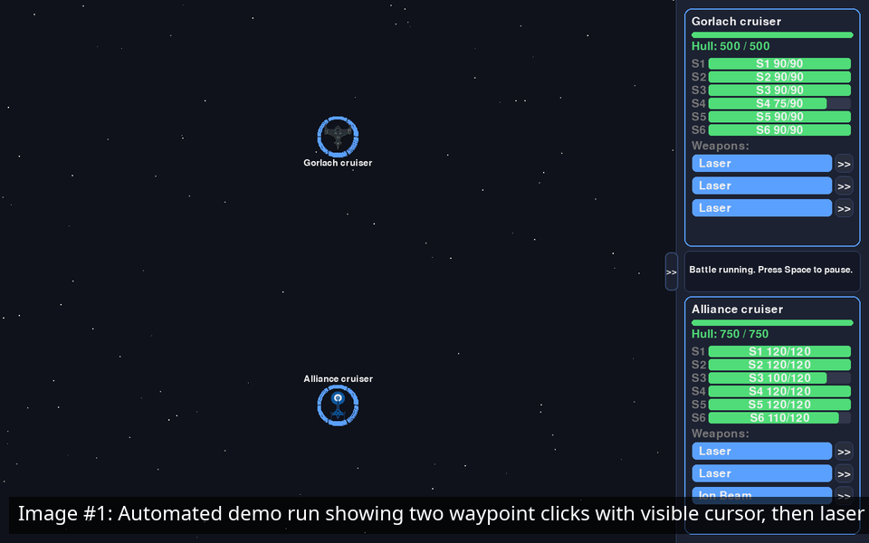

# Space Battle

A space game written using pygame.

## Gameplay Demo



_Image #1: Scripted 10-second run harness that auto-unpauses, sets a waypoint, and fires._

## Capture a New 10-Second GIF

```bash
make capture-gif
```

Equivalent direct command:

```bash
./scripts/capture_demo_gif.sh --duration 10 --output assets/demo/gameplay.gif --fps 20 --display "${DISPLAY:-:0.0}" --geometry 1280x720
```

Requirements:
- `ffmpeg` installed and on `PATH`
- An X11 display available at the selected `--display`
