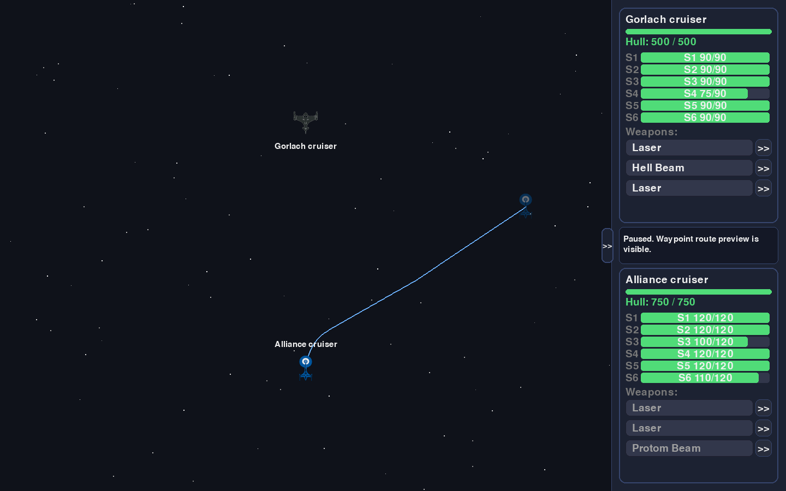
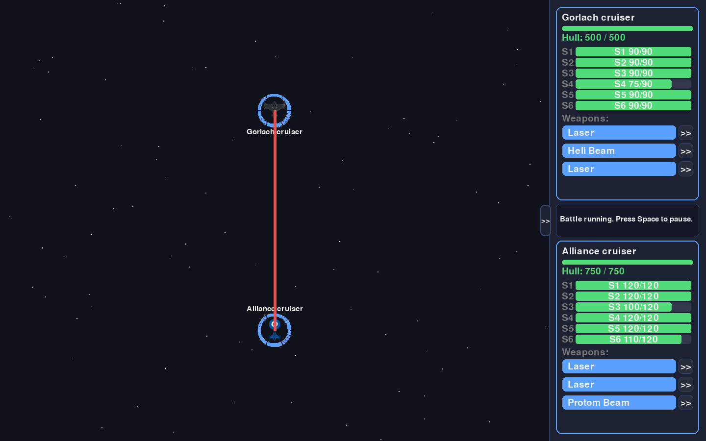
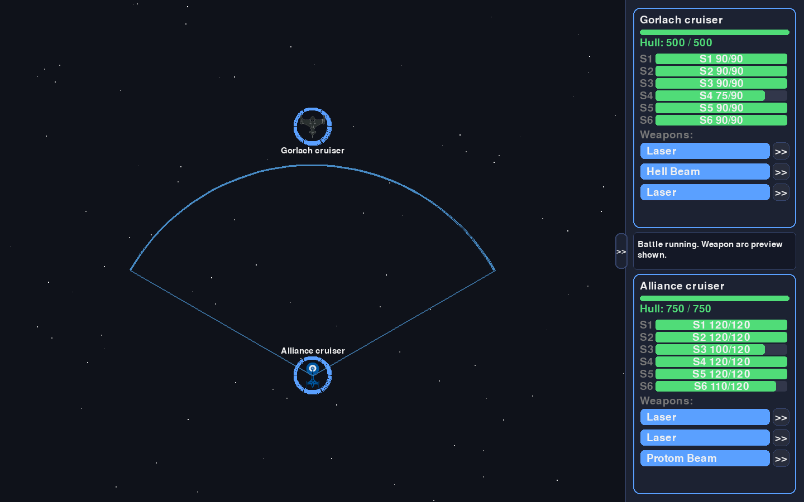
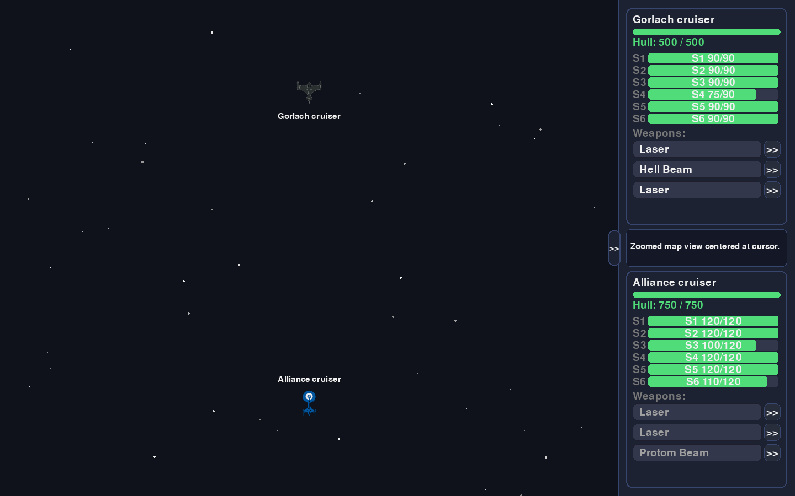
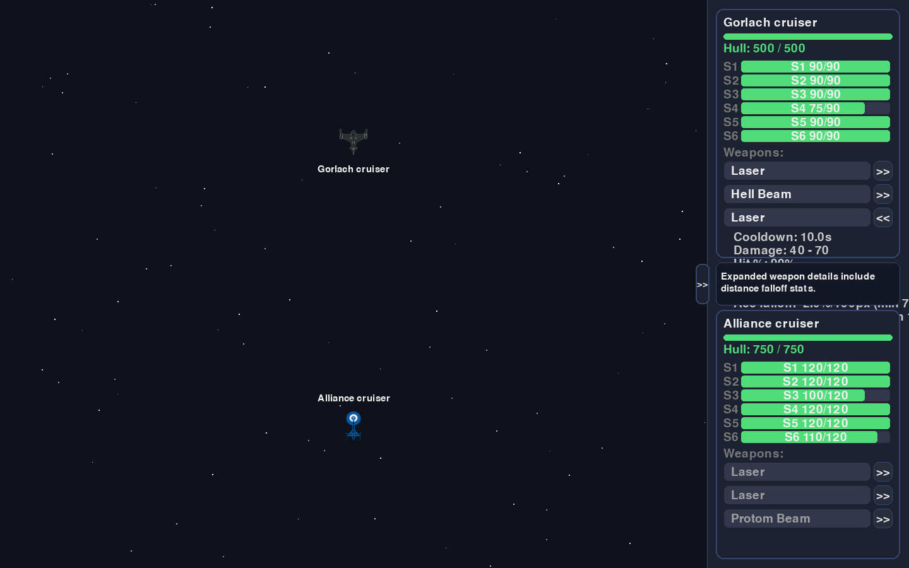

# Space Battle Manual

`Space Battle` is a real-time 1v1 cruiser duel. You pilot the Alliance cruiser, manage heading and route, and fire mount-specific weapons while a CPU opponent tracks and attacks you.

## Regenerate Screenshots

All screenshots in this manual are generated from the game with a deterministic script:

```bash
make manual-screenshots
```

Generated images are written to `docs/images/manual/`.

## Getting Started

1. Install dependencies:

```bash
uv sync
```

2. Launch the game:

```bash
make run
```

3. Start combat from the menu with `Enter`, `Space`, or mouse click on `NEW GAME`.

## Battle HUD and Layout

- Left side: zoomable battle map with ships, route preview, and combat effects.
- Right side: CPU and player status cards, shield bars, and weapon controls/details.
- Bottom panel text: current battle state and recent combat messages.


## Controls

- `Space`: pause/resume battle.
- `A` / `D`: rotate ship left/right while unpaused.
- `Left click` on map while paused:
  - `Ctrl + Click`: replace route with one waypoint.
  - `Shift + Click`: append waypoint to existing route.
- `Ctrl+Z` / `Ctrl+Y`: undo/redo waypoint edits.
- Mouse wheel: zoom map at cursor location.
- `Esc`: open pause overlay (`RESUME` / `QUIT`).
- Left click on your weapon buttons:
  - unpaused: fire if available, otherwise queue.
  - paused: queue/unqueue for auto-fire when legal.

## Route Planning and Waypoints

While paused, you can stage route changes before resuming combat. The game shows a turn-limited dashed preview and final ghost ship marker so you can estimate your future heading and position.



Manual steering (`A`/`D`) immediately clears queued waypoints once the battle is running.

## Combat Basics

- Weapons have cooldowns in real seconds.
- Firing consumes charges only when a weapon has finite ammo.
- CPU auto-fires on cadence when a legal shot is available.
- A battle ends when either ship hull reaches `0`.



## Weapon Arcs and Facing

Each weapon has:

- `Facing`: mount orientation offset from ship heading.
- `Arc`: legal firing cone in degrees.

Hovering a player weapon row renders the projected firing arc on the map.



## Zoom and Situational Awareness

Map zoom is cursor-centered, so you can quickly inspect local maneuvering or zoom back out for strategic spacing.



## Distance Falloff (Advanced)

Weapon detail rows include distance scaling stats:

- Accuracy falloff per `100px` plus minimum hit floor.
- Damage falloff per `100px` plus minimum damage multiplier floor.

These values determine how quickly long-range shots degrade.



## Configuration Reference

Gameplay tuning is data-driven:

- `data/weapons.yaml`: damage, cooldowns, arcs, facing defaults, and distance falloff.
- `data/ships.yaml`: hull/shields, rotation speed, and per-mount weapon layout.

Example weapon entry:

```yaml
Ion Beam:
  damage_min: 80
  damage_max: 120
  cooldown: 3
  hit_chance: 75
  charges: null
  weapon_type: heavy
  firing_arc_deg: 60
  accuracy_falloff_per_100px: 6.0
  min_hit_chance: 35
  damage_falloff_per_100px: 0.1
  min_damage_multiplier: 0.4
```
